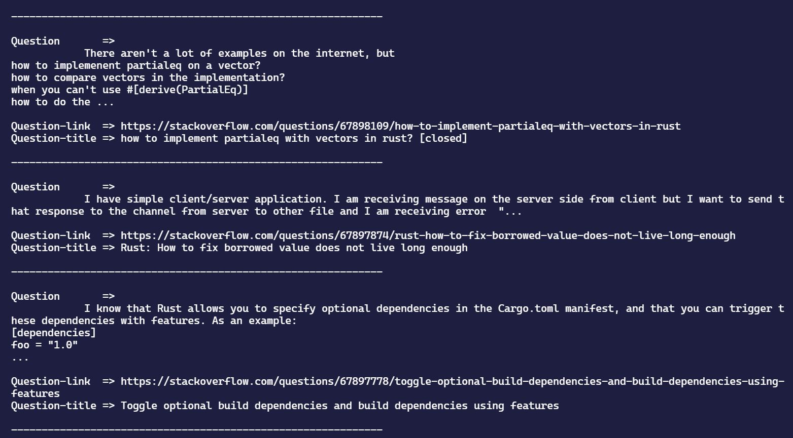

## Scraping Stackoverflow with Rust
It will extract the question, question link and title from stackoverflow. This scraper is inspired from [Kadekillary Scarper](https://github.com/kadekillary/scraping-with-rust) with updated libraries and some more features added.


#### Libraries Used
* [Reqwest](https://crates.io/crates/reqwest) 
    >An ergonomic, batteries-included HTTP Client for Rust.
* [Select](https://crates.io/crates/select)
    >A Rust library to extract useful data from HTML documents, suitable for web scraping

#### Features
* Simple and Fast
* Async get request

#### How to run
```
cargo run
```

#### Sample Output


