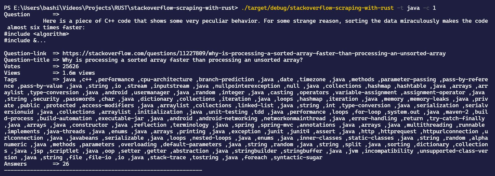

## Scraping Stackoverflow with Rust
It will extract the title, question link, answers count, view count and votes from stackoverflow depending on the tag parameter and count. This scraper is inspired from [Kadekillary Scarper](https://github.com/kadekillary/scraping-with-rust) with updated libraries and some more features added.


#### Features
* Simple and Fast
* Async get request
* Cli mode

<h3>Topics -> rust, reqwest, selectrs, scraping</h3>
<h5>Preview Link -> <u><a href="https://drive.google.com/file/d/1SjQ0U1JZF6nn74PgpHDnurwvjEGGl-VH/preview">stackoverflow-scraping-with-rust</a></u></h5>
<h5>Source Code Link -> <u><a href="https://github.com/chaudharypraveen98/stackoverflow-scraping-with-rust">GitHub</a></u></h5>                       

**What We are going to do?**
<ol>
    <li>Getting argument from the command line using Clap library</li>
    <li>Make a request using the Reqwest library</li>
    <li>Scraping using the Selectrs library</li>
</ol>

#### Libraries Used
* [Reqwest](https://crates.io/crates/reqwest) 
    >An ergonomic, batteries-included HTTP Client for Rust.
* [Select](https://crates.io/crates/select)
    >A Rust library to extract useful data from HTML documents, suitable for web scraping
* [Clap](https://crates.io/crates/clap)
    >A simple-to-use, efficient, and full-featured library for parsing command line arguments and subcommands.


**Installing Libraries**
<b>Simple add the following libraries in Cargo.toml</b>

```
[dependencies]
reqwest = { version = "0.10", features = ["json"] }
tokio = { version = "0.2", features = ["full"] }
select = "0.6.0-alpha.1"
clap = "2.33.3"
rand = "0.8.4"
```


**Before moving ahead, We must be aware of Css selectors**

**What are selectors/locators?**

A <b>CSS Selector</b> is a combination of an element selector and a value which identifies the web element within a web page.
<b>The choice of locator depends largely on your Application Under Test</b>

<b>Id</b>
An element’s id in XPATH is defined using: “[@id='example']” and in CSS using: “#” - ID's must be unique within the DOM.
Examples:

```
XPath: //div[@id='example']
CSS: #example
```

<b>Element Type</b>
The previous example showed //div in the xpath. That is the element type, which could be input for a text box or button, img for an image, or "a" for a link. 

```
Xpath: //input or
Css: =input
```

<b>Direct Child</b>
HTML pages are structured like XML, with children nested inside of parents. If you can locate, for example, the first link within a div, you can construct a string to reach it. A direct child in XPATH is defined by the use of a “/“, while on CSS, it’s defined using “>”. 
Examples:

```                        
XPath: //div/a
CSS: div > a
```

<b>Child or Sub-Child</b>
Writing nested divs can get tiring - and result in code that is brittle. Sometimes you expect the code to change, or want to skip layers. If an element could be inside another or one of its children, it’s defined in XPATH using “//” and in CSS just by a whitespace.
Examples:

```
XPath: //div//a
CSS: div a
```

<b>Class</b>
For classes, things are pretty similar in XPATH: “[@class='example']” while in CSS it’s just “.” 
Examples:

```
XPath: //div[@class='example']
CSS: .example
```

                        
## Step 1 -> Getting argument from the command line using Clap library  
We are using the Clap library to get the argument from the command line.
Thare are three cases : -
<ol>
    <li><b>Only tag is provided</b> => We will get only the posts from the input tag with default no of post i.e 16</li>
    <li><b>Only count is supplies</b> => We will get only input number of post from any random topic using the Rand library</li>
    <li><b>Both count and tag</b> => We will get input number of post of input tag</li>
</ol>
First we initialize the command line app names StackOverflow Scraper. Then mention all the three cases with there short and long name.

```
fn main() {
    let matches = App::new("StackOverflow Scraper")
        .version("1.0")
        .author("Praveen Chaudhary &lt;chaudharypraveen98@gmail.com&gt;")
        .about("It will scrape questions from stackoverflow depending on the tag.")
        .arg(
            Arg::with_name("tag")
                .short("t")
                .long("tag")
                .takes_value(true)
                .help("takes tag and scrape according to this"),
        )
        .arg(
            Arg::with_name("count")
                .short("c")
                .long("count")
                .takes_value(true)
                .help("gives n count of posts"),
        )
        .get_matches();
        ....
        ....
```

Once we have mentioned all the cases. Now we need to extract the argument value using the match which help us to find a particular pattern

```
    fn main() {
        .....
        .....
    
        if matches.is_present("tag") && matches.is_present("count") {
            let url = format!(
                "https://stackoverflow.com/questions/tagged/{}?tab=Votes",
                matches.value_of("tag").unwrap()
            );
            let count: i32 = matches.value_of("count").unwrap().parse::<i32>().unwrap();
            stackoverflow_post(&url, count as usize);
        } else if matches.is_present("tag") {
            let url = format!(
                "https://stackoverflow.com/questions/tagged/{}?tab=Votes",
                matches.value_of("tag").unwrap()
            );
            stackoverflow_post(&url, 16);
        } else if matches.is_present("count") {
            let url = get_random_url();
            let count: i32 = matches.value_of("count").unwrap().parse::<i32>().unwrap();
            stackoverflow_post(&url, count as usize);
        } else {        
            let url = get_random_url();        
            stackoverflow_post(&url, 16);
        }
    }
```

In the above code, we have used the <tt>stackoverflow_post</tt> function. We will learn about this in <b>Step 3</b>

## Step 2 -> Make a request using the Reqwest library  
We will use the reqwest library to make a get request to the stackoverflow website customized with the input tag

```
#[tokio::main]
async fn hacker_news(url: &str, count: usize) -> Result<(), reqwest::Error> {
    let resp = reqwest::get(url).await?;
    ....
```

## Step 3 -> Scraping using the Selectrs library  
We will use the css selectors to get the question post from the stackoverflow

```
#[tokio::main]
async fn hacker_news(url: &str, count: usize) -> Result<(), reqwest::Error> {
    ..... 
    ..... 

    let document = Document::from(&*resp.text().await?);

    for node in document.select(Class("mln24")).take(count) {
        let question = node.select(Class("excerpt")).next().unwrap().text();
        let title_element = node.select(Class("question-hyperlink")).next().unwrap();
        let title = title_element.text();
        let question_link = title_element.attr("href").unwrap();
        let votes = node.select(Class("vote-count-post")).next().unwrap().text();
        let views = node.select(Class("views")).next().unwrap().text();
        let striped_views = views.trim();
        let tags = node
            .select(Attr("class", "post-tag grid--cell"))
            .map(|tag| tag.text())
            .collect::&lt;Vec&lt;_&gt;&gt;();
        let answer = node
            .select(Or(
                Attr("class", "status answered-accepted").descendant(Name("strong")),
                Attr("class", "status answered").descendant(Name("strong")),
            ))
            .next()
            .unwrap()
            .text();
        println!("Question       => {}", question);
        println!("Question-link  => https://stackoverflow.com{}",question_link);
        println!("Question-title => {}", title);
        println!("Votes          => {}", votes);
        println!("Views          => {}", striped_views);
        println!("Tags           => {}", tags.join(" ,"));
        println!("Answers        => {}", answer);
        println!("-------------------------------------------------------------\n");
    }
    Ok(())
}
```

## Complete Code  

```
extern crate clap;
extern crate reqwest;
extern crate select;
extern crate tokio;

use clap::{App, Arg};
use rand::seq::SliceRandom;
use select::document::Document;
use select::predicate::{Attr, Class, Name, Or, Predicate};

fn main() {
    let matches = App::new("StackOverflow Scraper")
        .version("1.0")
        .author("Praveen Chaudhary &lt;chaudharypraveen98@gmail.com&gt;")
        .about("It will scrape questions from stackoverflow depending on the tag.")
        .arg(
            Arg::with_name("tag")
                .short("t")
                .long("tag")
                .takes_value(true)
                .help("takes tag and scrape according to this"),
        )
        .arg(
            Arg::with_name("count")
                .short("c")
                .long("count")
                .takes_value(true)
                .help("gives n count of posts"),
        )
        .get_matches();

    if matches.is_present("tag") && matches.is_present("count") {
        let url = format!(
            "https://stackoverflow.com/questions/tagged/{}?tab=Votes",
            matches.value_of("tag").unwrap()
        );
        let count: i32 = matches.value_of("count").unwrap().parse::<i32>().unwrap();
        hacker_news(&url, count as usize);
    } else if matches.is_present("tag") {
        let url = format!(
            "https://stackoverflow.com/questions/tagged/{}?tab=Votes",
            matches.value_of("tag").unwrap()
        );
        hacker_news(&url, 16);
    } else if matches.is_present("count") {
        let url = get_random_url();
        let count: i32 = matches.value_of("count").unwrap().parse::<i32>().unwrap();
        hacker_news(&url, count as usize);
    } else {        
        let url = get_random_url();        
        hacker_news(&url, 16);
    }
}

#[tokio::main]
async fn hacker_news(url: &str, count: usize) -> Result&lt;(), reqwest::Error&gt; {
    let resp = reqwest::get(url).await?;
    // println!("body = {:?}", resp.text().await?);
    // assert!(resp.status().is_success());
    let document = Document::from(&*resp.text().await?);

    for node in document.select(Class("mln24")).take(count) {
        let question = node.select(Class("excerpt")).next().unwrap().text();
        let title_element = node.select(Class("question-hyperlink")).next().unwrap();
        let title = title_element.text();
        let question_link = title_element.attr("href").unwrap();
        let votes = node.select(Class("vote-count-post")).next().unwrap().text();
        let views = node.select(Class("views")).next().unwrap().text();
        let striped_views = views.trim();
        let tags = node
            .select(Attr("class", "post-tag grid--cell"))
            .map(|tag| tag.text())
            .collect::&lt;Vec&lt;_&gt;&gt;();
        let answer = node
            .select(Or(
                Attr("class", "status answered-accepted").descendant(Name("strong")),
                Attr("class", "status answered").descendant(Name("strong")),
            ))
            .next()
            .unwrap()
            .text();
        println!("Question       => {}", question);
        println!("Question-link  => https://stackoverflow.com{}",question_link);
        println!("Question-title => {}", title);
        println!("Votes          => {}", votes);
        println!("Views          => {}", striped_views);
        println!("Tags           => {}", tags.join(" ,"));
        println!("Answers        => {}", answer);
        println!("-------------------------------------------------------------\n");
    }
    Ok(())
}

// Getting random tag
fn get_random_url() -> String {
    let default_tags = vec!["python", "rust", "c#", "android", "html", "javascript"];
    let random_tag = default_tags.choose(&mut rand::thread_rng()).unwrap();
    let url = format!(
        "https://stackoverflow.com/questions/tagged/{}?tab=Votes",
        random_tag
    );
    url.to_string()
}
```

## How to run our scraper?  
<ol>
    <li>Build the executable by <code>cargo build</code></li>
    <li>Run by <code>./target/debug/stackoverflow-scraping-with-rust -t &lt;tag&gt; -c &lt;count&gt;</code> &lt; tag &gt; is the topic from which you want to scrape &lt; count &gt; is the number of posts/threads to be scraped. Note the maximum limit is 16. Like this <code>./target/debug/stackoverflow-scraping-with-rust -t java -c 1</code></li>
</ol>

## Deployment  
You can deploy on <a href="https://www.heroku.com/">Heroku</a> with the help of <a href="https://circleci.com/">Circle CI</a>
You can read more about on <a href="https://circleci.com/blog/rust-cd/">CircleCI Blog</a>

## Web Preview / Output  
<a href="https://drive.google.com/file/d/1SjQ0U1JZF6nn74PgpHDnurwvjEGGl-VH/preview">
    <iframe src="https://drive.google.com/file/d/1SjQ0U1JZF6nn74PgpHDnurwvjEGGl-VH/preview" width="640" height="480" allow="autoplay"></iframe>
</a>
<span>Web preview on deployment</span>
Placeholder text by <a href="https://chaudharypraveen98.github.io/">Praveen Chaudhary</a>
&middot; Images by <a href="hhttps://chaudharypraveen98.github.io/binarybeast/">Binary Beast</a>


#### Sample Output


